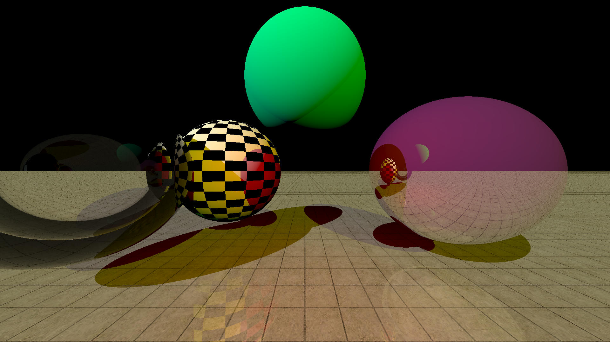

# simple-raytracer
Toy raytracer project written in Rust.

### example images:



### implemented features:

* support of multiple objects: spheres and planes
* support of multiple lights: spherical and parallel
* texturing
* full and partial reflection
* full and partial refraction(*)
* simple gamma encoding for more correct light displaying

Project's progress can be seen in ```img``` directory

### TODO's:
* **debug img/example-10 !!!**
* fix small todo-s in code
* add triangles
* add better gamma encoding
* refactor code
* rewrite on GPU

### useful resources to learn more:
* https://bheisler.github.io/post/writing-raytracer-in-rust-part-1/
* https://www.scratchapixel.com/index.html
* https://youtu.be/iOlehM5kNSk?si=AGv3uPLxNScHfkX0